# REAL-TIME AIR-BORNE TARGET CLASSIFICATION USING KINEMATICS DATA FOR COASTAL SURVEILLANCE RADAR

An AI-powered real-time airborne target classification system using machine learning and kinematic trajectory analysis for coastal surveillance radar environments.

---
## 🚀 Live Demo

🔗 Deployed Application: https://aerosense-target-identification-system.onrender.com

📌 Note:
This deployment demonstrates the real-time aircraft classification workflow using uploaded CSV trajectory data for testing purposes.
---


# 📌 Project Overview

This project presents a real-time machine learning framework for airborne target classification using kinematic data obtained from coastal surveillance radar systems. The system processes trajectory-based motion parameters such as height, resultant velocity, resultant acceleration, and Automatic Gain Control (AGC) to classify airborne targets into multiple aircraft categories.

The framework integrates:
- Real-time UDP socket communication
- Sliding-window time-series feature extraction
- Statistical and temporal feature engineering
- Machine learning classification
- Interactive Streamlit-based visualization dashboard

The proposed system is capable of identifying multiple aircraft classes with high accuracy and low prediction latency, making it suitable for defense surveillance and operational radar environments.

---

# 🚀 Key Features

✔ Real-time airborne target classification  
✔ UDP-based radar data acquisition  
✔ Sliding-window kinematic feature extraction  
✔ Multi-model machine learning evaluation  
✔ Random Forest optimized classification  
✔ Real-time analytics dashboard  
✔ Probability-based prediction visualization  
✔ Confusion matrix & ROC analysis  
✔ Feature selection using consensus ranking  
✔ Streamlit interactive web interface  
✔ CSV report generation & export support  

---
# 🛡 Problem Statement
Traditional radar target classification methods primarily depend on:

- Radar Cross Section (RCS)
- Doppler signatures
- Visual interpretation

These approaches face limitations under:

- Electronic warfare conditions
- Stealth technologies
- Noisy environments
- Real-time operational constraints

This project solves these challenges by utilizing aircraft motion characteristics (kinematics) combined with machine learning techniques for accurate real-time classification.
---

# 🎯 Objectives

- Develop a comprehensive kinematic feature extraction framework
- Build a real-time aircraft classification pipeline
- Evaluate multiple machine learning models
- Achieve high classification accuracy (>95%)
- Integrate real-time UDP communication
- Provide an operational visualization dashboard
- Support defense surveillance applications

---

# 🧠 Technologies Used

## Programming Language
- Python

## Machine Learning Libraries
- Scikit-learn
- XGBoost
- NumPy
- Pandas
- SciPy

## Visualization Libraries
- Matplotlib
- Seaborn
- Plotly

## Frontend / Dashboard
- Streamlit

## Communication Protocol
- UDP Socket Programming

---

# 📂 Project Structure

```bash
├── dataset/
│   ├── raw_data/
│   ├── processed_data/
│
├── models/
│   ├── random_forest.pkl
│   ├── scaler.pkl
│   ├── metadata.json
│
├── unseenDATA/
├── diagrams/
│   ├── system_architecture.png
│   ├── dfd.png
│   ├── methodology_flowchart.png
│   ├── use_case_diagram.png
│   ├── ui_architecture.png
│   ├── confusion_matrix.png
│   ├── roc_curve.png
│
├── realtime_app.py
├── udp_dat_processor.py
├── udp_receiver.py
├── utils.py
├── requirements.txt
├── README.md
└── start.sh
```

---

# 📊 Dataset Description

The dataset consists of aircraft kinematic trajectory parameters collected from simulated and operational radar environments.

| Feature | Description |
|---|---|
| Height | Aircraft altitude |
| Resultant Velocity | Velocity vector magnitude |
| Resultant Acceleration | Acceleration vector magnitude |
| AGC | Automatic Gain Control |
| Time | Timestamp |

---

# ⚙️ Data Processing Pipeline
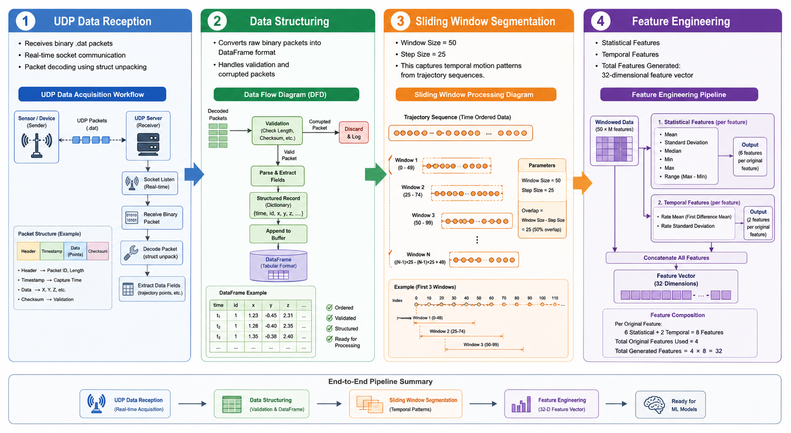

## Stage 1: UDP Data Reception
- Receives binary .dat packets
- Real-time socket communication
- Packet decoding using struct unpacking

## Stage 2: Data Structuring
- Converts raw binary packets into DataFrame format
- Handles validation and corrupted packets

## Stage 3: Sliding Window Segmentation
- Window Size = 50
- Step Size = 25

This captures temporal motion patterns from trajectory sequences.
## Stage 4: Feature Engineering
### Statistical Features
- Mean
- Standard Deviation
- Median
- Min
- Max
- Range
### Temporal Features
- Rate Mean
- Rate Standard Deviation

Total Features Generated:

- 32-dimensional feature vector
---

# 🧮 Feature Selection Techniques

Multiple feature selection methods were used:

- ANOVA F-Test
- Mutual Information
- Random Forest Importance
- XGBoost Importance
- Consensus Ranking

Top 15 discriminative features selected.
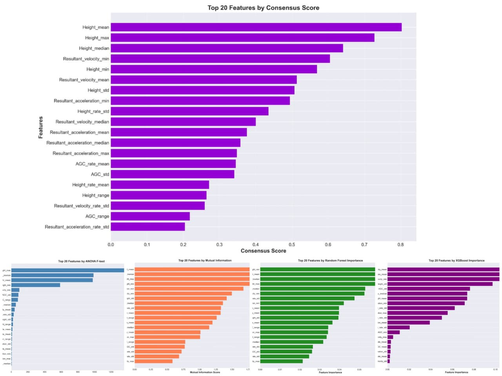
---

# 🤖 Machine Learning Models

| Model               | Accuracy |
| ------------------- | -------- |
| Logistic Regression | 81.5%    |
| KNN                 | 85.2%    |
| SVM                 | 86.8%    |
| Decision Tree       | 82.3%    |
| Random Forest       | 95.8%    |
| Gradient Boosting   | 93.1%    |
| XGBoost             | 94.0%    |


---

# 🏆 Best Model: Random Forest

Why Random Forest?
- High accuracy
- Better generalization
- Reduced overfitting
- Fast prediction capability
- Strong multidimensional handling

---

# 📈 Performance Metrics

- Accuracy
- Precision
- Recall
- F1-Score
- ROC Curve
- Cross Validation


📌 Add Figures Here:

Confusion Matrix
ROC Curve
Learning Curve
Accuracy Comparison Graph
---

# 📡 Real-Time UDP Communication

```python
HOST = "0.0.0.0"
PORT = 5005
```

Packet Format:

```python
<ffffi
```

Contains:
- Time
- Height
- Acceleration
- Velocity
- AGC

---


# 📱 UI Modules
1. Data Reception Screen
Displays incoming real-time radar data.
Data Reception Screen
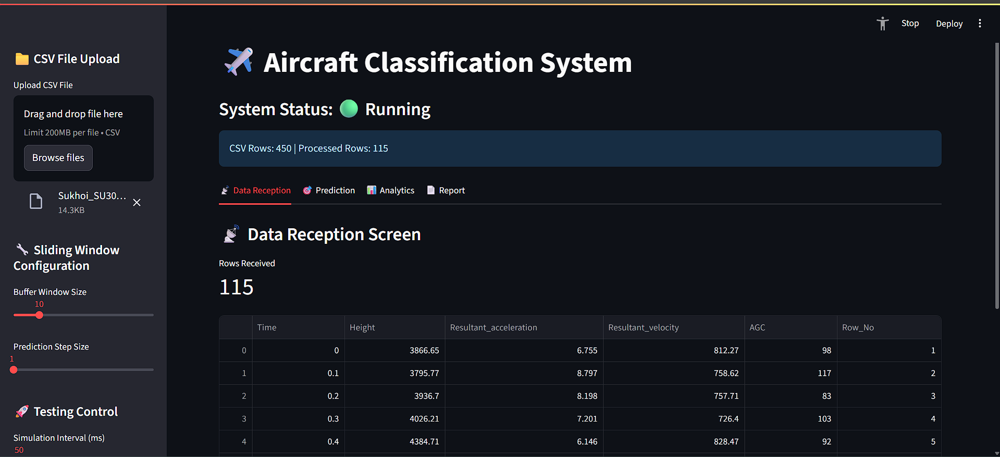

2. Prediction Dashboard
Shows:
- Predicted aircraft class
- Confidence percentage
- Probability distribution

Prediction Screen
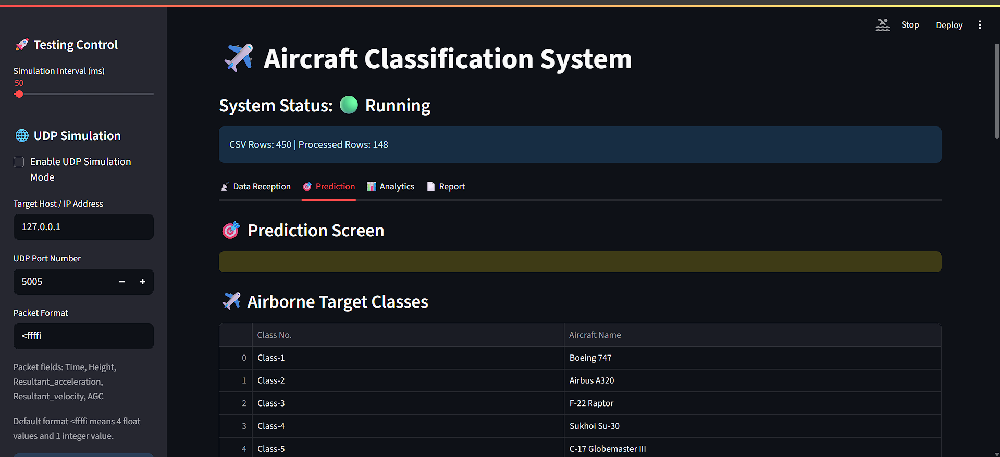
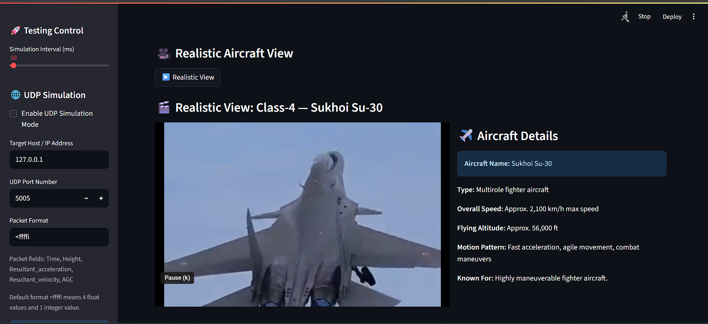
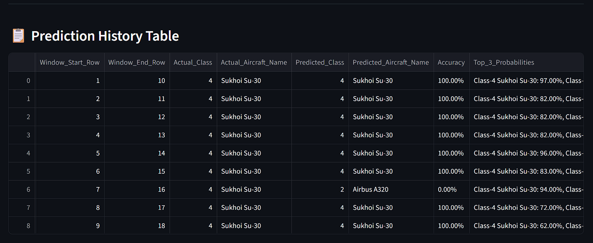
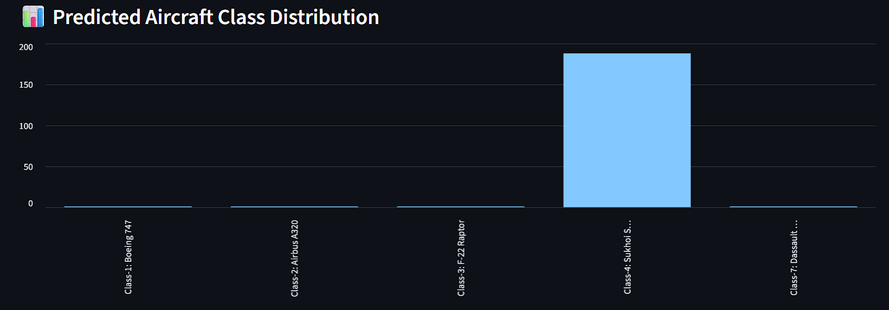

3. Analytics Dashboard
Includes:
- Height vs Time
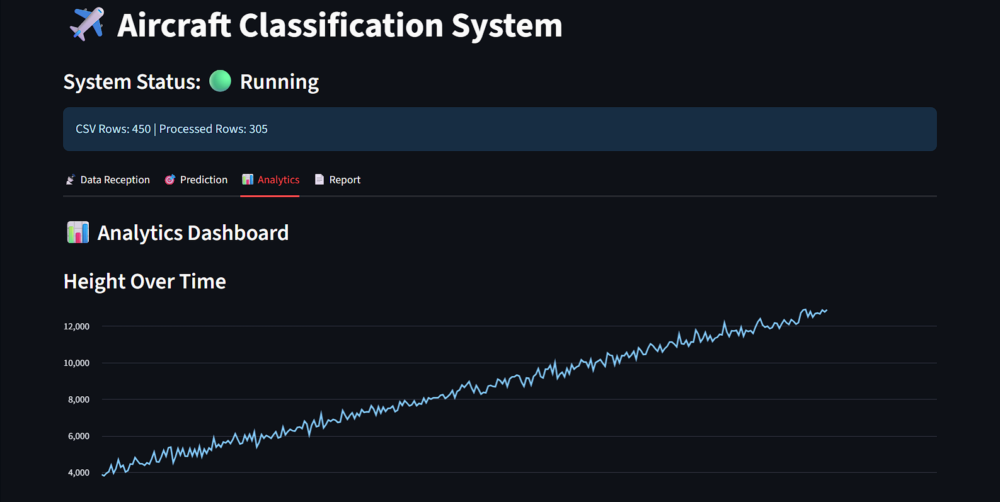

- Velocity vs Time
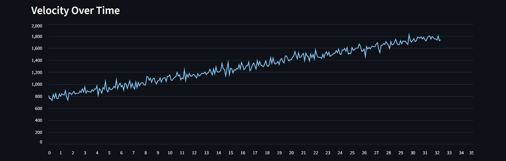

- Acceleration vs Time
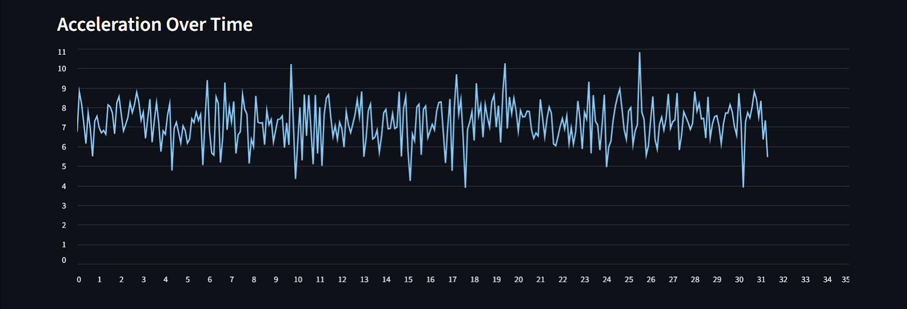

- Height vs Velocity Scatter plots
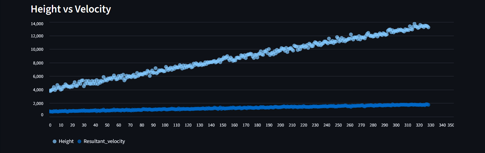


4. Performance Evaluation Screen

Displays:
- Accuracy metrics
- Confusion matrix
- Class distribution
- ROC curves

Performance Dashboard
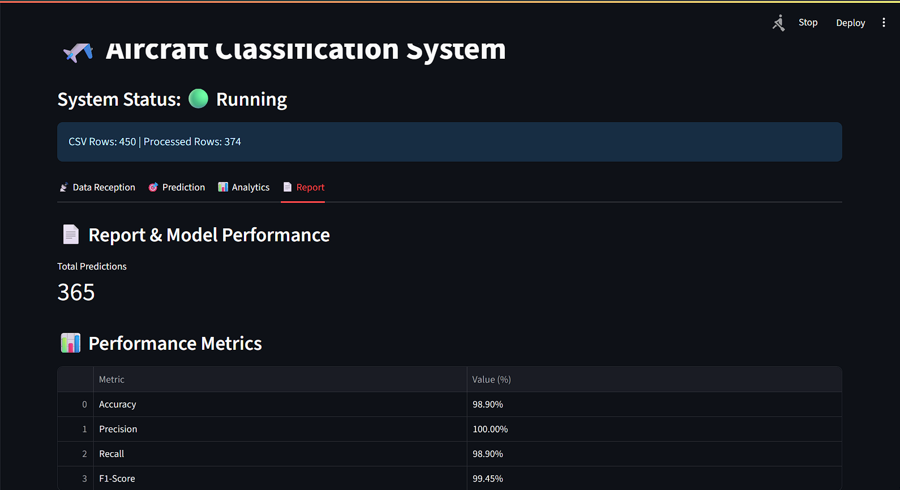
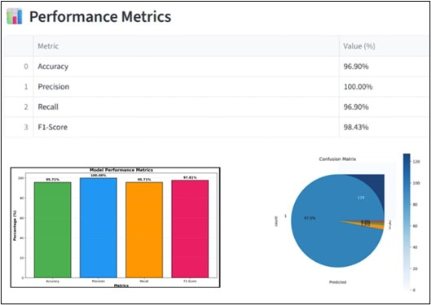
---

# 📐 System Architecture
The proposed framework consists of:
- UDP Receiver Module
- Data Structuring Module
- Feature Engineering Module
- Classification Engine
- Visualization Dashboard

External & Internal System Workflow Diagram
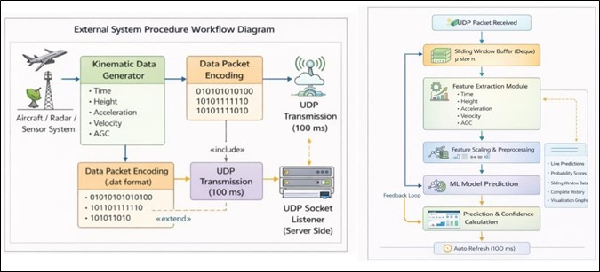
---


# 📊 Results

- Accuracy: 95.8%
- Low latency prediction
- Real-time operational capability
- High classification reliability

---

# 🔮 Future Scope

- Deep Learning Integration
- Cloud Deployment
- Explainable AI
- Multi-modal Sensor Fusion
- Edge AI Deployment

---

# 💻 Installation

## Clone Repository

```bash
git clone https://github.com/Susmita-Dev-04/Aeroborne-target-identification-system.git
```

## Install Dependencies

```bash
pip install -r requirements.txt
```

## Run Application

```bash
streamlit run realtime_app.py
```

---
# 📌 Hardware Requirements
| Component | Requirement        |
| --------- | ------------------ |
| RAM       | 8 GB Recommended   |
| Processor | Intel i5 / Ryzen 5 |
| Storage   | 500MB+             |
| OS        | Windows / Linux    |


# 👩‍💻 Authors

## Susmita Das
Final Year B.Tech CSE Student  
GIFT Autonomous, Bhubaneswar  

- Machine Learning & AI Enthusiast
- Real-Time Aircraft Classification Research
- Python | ML | Streamlit | Radar Data Processing


GitHub: https://github.com/Susmita-Dev-04  
LinkedIn: https://linkedin.com/in/susmita-das-2b61a6312
---

# ⭐ Project Highlights

✔ Real-Time Classification  
✔ AI + Machine Learning Integration  
✔ UDP Radar Communication  
✔ Streamlit Visualization Dashboard  
✔ 95.8% Classification Accuracy  
✔ Operational Deployment Ready
